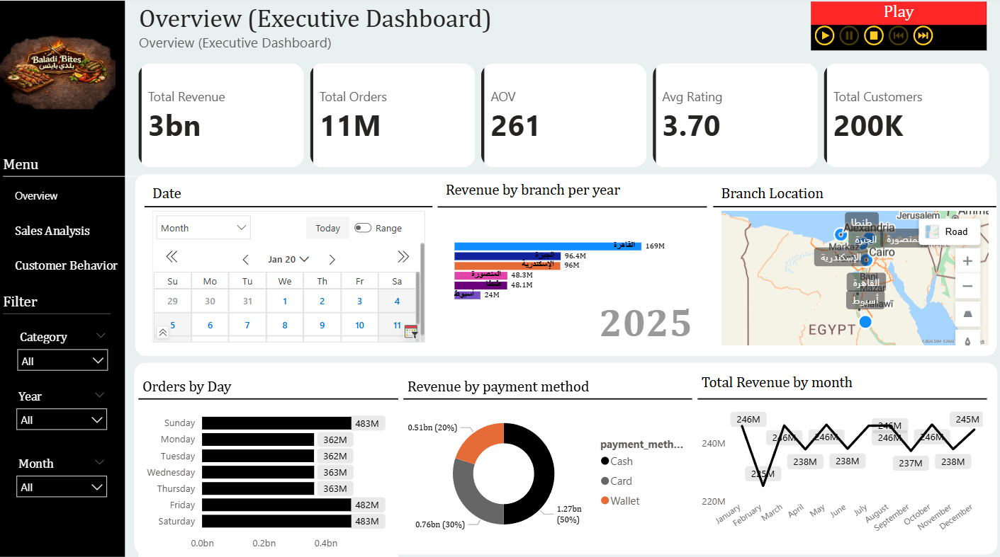
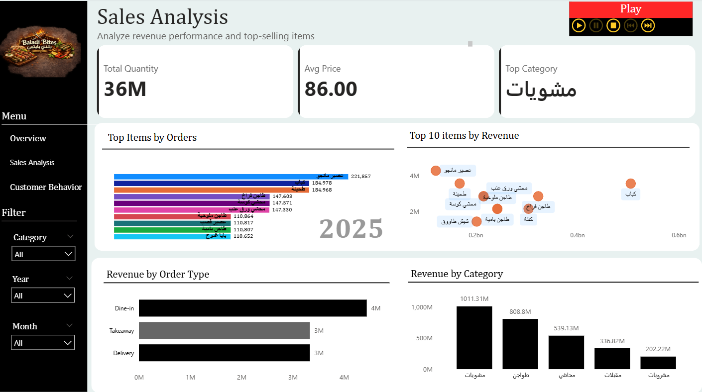
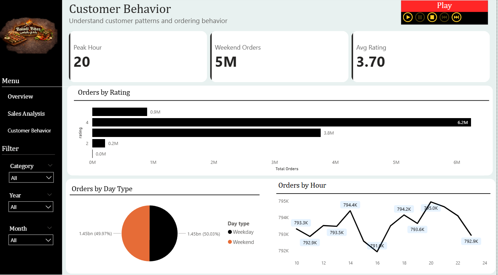

# 📊 Restaurant Analytics Dashboard

## 🚀 Overview

End-to-end analytics project analyzing **11M+ restaurant transactions** to uncover revenue drivers, customer behavior, and operational patterns.

Built using **Databricks (SQL)** for scalable data processing and **Power BI** for business intelligence reporting.

---

## 🧠 Business Problem

The goal of this project is to analyze restaurant performance and identify key factors affecting revenue, customer behavior, and operational efficiency.

---

## ⚙️ Tools & Technologies

* Databricks (SQL)
* Power BI
* DirectQuery
* CSV & JSON

---

## 📊 Key Metrics

* 💰 Revenue: ~3B
* 🧾 Orders: 11M
* 📍 Top Branch: Cairo
* 🕗 Peak Hour: 8 PM
* ⭐ Avg Rating: 3.7

---

## ⚙️ Data Transformation (UNION-Based Event Model)

This project uses a **UNION ALL approach** to combine orders and transactions into a unified event-based table.

Each record is classified using an `event_type` column, allowing flexible analysis of different data sources within a single analytical model.

```sql
-- =========================================
-- Restaurant Analytics - Data Preparation
-- Bronze → Silver Layer (UNION-Based Model)
-- =========================================

-- Step 1: Clean Orders Data
CREATE OR REPLACE TEMP VIEW clean_orders AS
SELECT
    order_id,
    CAST(order_date AS DATE) AS order_date,
    item_name,
    category,
    CAST(price AS DOUBLE) AS price,
    CAST(quantity AS INT) AS quantity,
    CAST(total_amount AS DOUBLE) AS total_amount,
    branch,
    hour
FROM bronze_orders;

-- Step 2: Clean Transactions Data
CREATE OR REPLACE TEMP VIEW clean_transactions AS
SELECT
    customer_id,
    discount,
    is_weekend,
    order_type,
    payment_method,
    item_name,
    branch,
    hour
FROM bronze_transactions;

-- Step 3: Create Unified Event Table
CREATE OR REPLACE TABLE silver_events AS

SELECT
    order_id,
    order_date,
    item_name,
    category,
    price,
    quantity,
    total_amount,
    branch,
    hour,

    NULL AS customer_id,
    NULL AS discount,
    NULL AS is_weekend,
    NULL AS order_type,
    NULL AS payment_method,

    'order' AS event_type,
    YEAR(order_date) AS year,
    MONTH(order_date) AS month

FROM clean_orders

UNION ALL

SELECT
    NULL AS order_id,
    NULL AS order_date,
    item_name,
    category,
    NULL AS price,
    NULL AS quantity,
    NULL AS total_amount,
    branch,
    hour,

    customer_id,
    discount,
    is_weekend,
    order_type,
    payment_method,

    'transaction' AS event_type,
    NULL AS year,
    NULL AS month

FROM clean_transactions;
```

---

## 🧪 Data Quality Checks

* Ensured consistent data types using CAST
* Structured data into clean analytical layers
* Validated records after UNION operation

---

## 📈 Dashboard Pages

* **Overview**: KPIs & revenue trends
* **Sales Analysis**: Top items & categories
* **Customer Behavior**: Patterns, peak hours & order types

---

## 🔍 Key Insights

* Peak sales occur at **8 PM**, indicating optimal staffing hours
* A small number of items drive the majority of revenue
* Certain branches significantly outperform others
* Customer behavior differs between weekdays and weekends

---

## 💡 Recommendations

* Optimize staffing during peak hours (especially 8 PM)
* Focus on high-performing products to maximize revenue
* Improve performance of underperforming branches
* Use customer behavior insights for targeted promotions

---

## 💥 Business Impact

This analysis enables **data-driven decision making** to improve revenue, optimize operations, and enhance customer experience.

---

## 📸 Preview
  
  


---

## 🏗️ Architecture

```
restaurant-analytics-project/
├── data/
│   ├── raw (CSV, JSON)
│   └── processed (Databricks Tables)

├── notebooks/
│   └── data_preparation.sql

├── powerbi/
│   └── dashboard.pbix

├── screenshots/
│   ├── overview.png
│   ├── sales.png
│   └── behavior.png

└── README.md
```
---
## 👤 Author

**Amr Youssef**
Data Analyst | Power BI | Databricks

🔗 https://www.linkedin.com/in/amr-yousef-6b206986/
